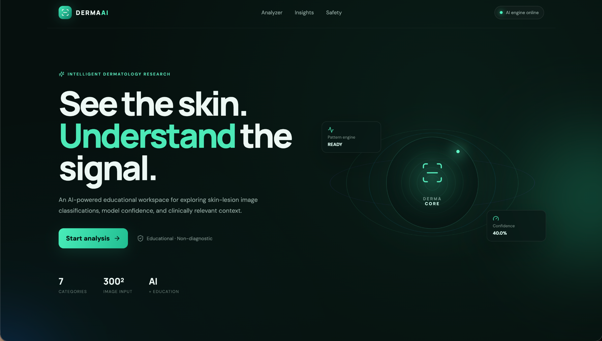
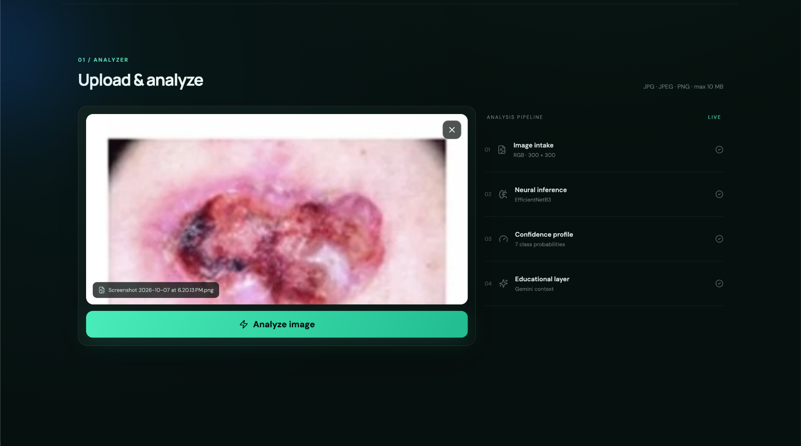
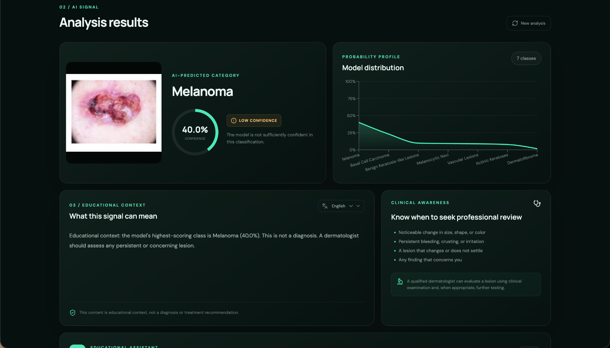
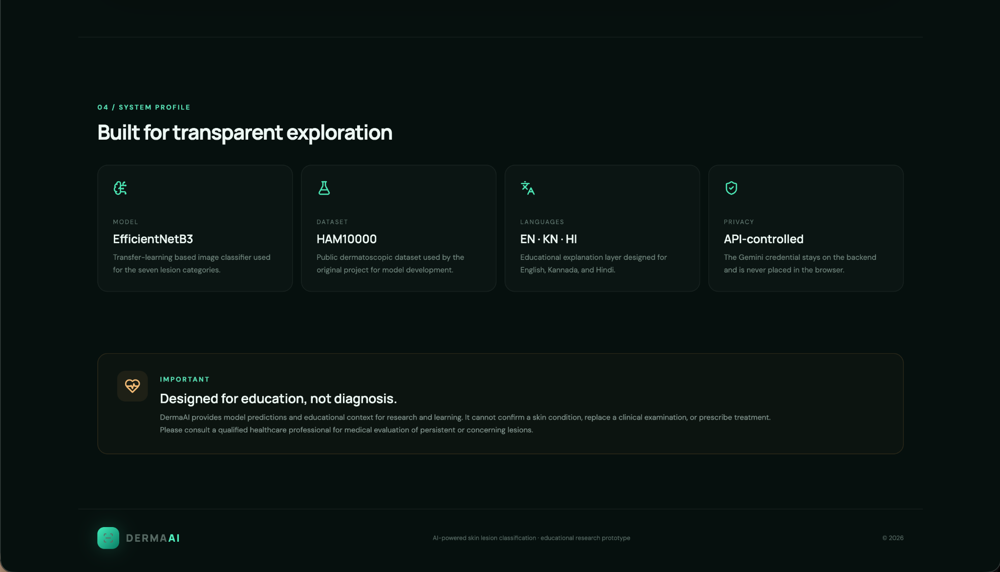

# 🔬 DermaAI — AI-Powered Skin Lesion Classification & Educational Assistant

> **AI For Healthcare | Computer Vision + Deep Learning + Generative AI**

DermaAI is an AI-powered healthcare-awareness platform that combines **Computer Vision, Deep Learning, Transfer Learning, and Generative AI** in one web application.

The system uses an **EfficientNetB3-based transfer-learning model** trained on the **HAM10000 dermoscopic image dataset** to classify suitable dermoscopic skin-lesion images into seven categories. The predicted category and confidence are then provided as context to **Google Gemini**, which generates understandable educational information and supports multilingual interaction.

> ⚠️ **Medical Safety:** DermaAI is an educational/research prototype. It is **not a medical diagnostic system** and must not be used as a substitute for professional medical advice, diagnosis, or treatment.

---

# 🏆 Unstop — AI For Healthcare

## Problem Statement

Skin-related conditions can be difficult for individuals to understand, especially when access to dermatological expertise is limited.

DermaAI addresses the need for an **AI-assisted educational platform** that can analyze suitable dermoscopic skin-lesion images and provide understandable information about the predicted lesion category.

The system combines image classification with Generative AI to make technical healthcare information easier to understand.

---

# 💡 Project Title

## DermaAI — AI-Powered Skin Lesion Classification & Educational Assistant

---

# 🚀 Proposed Solution

DermaAI provides a web-based AI system that:

1. Accepts a suitable dermoscopic skin-lesion image.
2. Processes the image using the required preprocessing pipeline.
3. Uses an **EfficientNetB3 deep-learning model** for classification.
4. Predicts one of seven supported lesion categories.
5. Displays the predicted category and model confidence.
6. Sends the prediction context to **Google Gemini**.
7. Generates educational information in a user-friendly format.
8. Supports interaction in **English, Kannada, and Hindi**.

The system is designed as an **educational AI assistant**, not as an autonomous medical diagnosis tool.

---

# 🎯 Objectives

- Apply deep learning to skin-lesion image classification.
- Use transfer learning with EfficientNetB3.
- Build a practical healthcare-oriented AI application.
- Provide understandable educational information about predictions.
- Integrate Generative AI with a computer-vision pipeline.
- Support multilingual healthcare education.
- Demonstrate a complete AI application from model training to web deployment.

---

# ✨ Key Features

### 🧠 AI Skin-Lesion Classification

Classifies dermoscopic images into seven supported categories using a trained EfficientNetB3 model.

### 🔬 Deep Learning

Uses transfer learning and fine-tuning to build the image-classification model.

### 🤖 Generative AI Assistant

Google Gemini generates educational explanations based on the model prediction.

### 🌐 Multilingual Support

Educational responses can be provided in:

- English
- Kannada
- Hindi

### 📊 Prediction Confidence

Displays the classification confidence produced by the trained model.

### 🖥️ Modern Web Interface

Built using React and Vite with a modern responsive interface.

### ⚡ FastAPI Backend

Provides API endpoints for health checks and image prediction.

### 🔐 Secure API-Key Handling

Gemini credentials are stored using environment variables and are not committed to the repository.

### 📚 Machine Learning Notebook

The complete machine-learning development and experimentation process is documented in:

`AI_Skin_Disease_Consultant.ipynb`

---

# 🖥️ Application Preview

## Home



## Image Analyzer



## Prediction Results



## System Profile



---

# 📓 Machine Learning Notebook

The repository contains the complete machine-learning development notebook:

**`AI_Skin_Disease_Consultant.ipynb`**

The notebook covers:

- Dataset exploration
- Image preprocessing
- Data preparation
- Class distribution analysis
- Transfer learning
- EfficientNetB3 configuration
- Model training
- Fine-tuning
- Model evaluation
- Prediction analysis
- Model saving

The notebook documents the experimental machine-learning workflow, while the trained `.keras` model is used by the FastAPI backend for application inference.

---

# 🗂️ Dataset

## HAM10000

DermaAI uses the **HAM10000 (Human Against Machine with 10000 training images)** dermoscopic image dataset.

The dataset contains **10,015 dermoscopic images** covering seven diagnostic categories.

| Class | Description | Images |
|---|---|---:|
| `nv` | Melanocytic Nevi | 6,705 |
| `mel` | Melanoma | 1,113 |
| `bkl` | Benign Keratosis-like Lesions | 1,099 |
| `bcc` | Basal Cell Carcinoma | 514 |
| `akiec` | Actinic Keratoses / Intraepithelial Carcinoma | 327 |
| `vasc` | Vascular Lesions | 142 |
| `df` | Dermatofibroma | 115 |

The dataset is highly imbalanced, with some lesion classes containing significantly fewer samples than others.

---

# 🧠 Deep Learning Model

## EfficientNetB3

The classification model is based on **EfficientNetB3** using transfer learning.

### Model Pipeline

```text
HAM10000 Dataset
        ↓
Image Preprocessing
        ↓
EfficientNetB3
        ↓
Transfer Learning
        ↓
Classification Head
        ↓
Fine-Tuning
        ↓
7-Class Prediction
```

The trained model is stored as:

```text
model/best_skin_model_phase2.keras
```

The model is loaded by the FastAPI backend during inference.

---

# 🖼️ Image Processing

The application performs image preprocessing before inference.

```text
Uploaded Image
      ↓
Image Validation
      ↓
Resize / Preprocessing
      ↓
Tensor Conversion
      ↓
Model Input
      ↓
Prediction
```

---

# 🏋️ Model Training Workflow

```text
Dataset
   ↓
Data Exploration
   ↓
Class Distribution Analysis
   ↓
Image Preprocessing
   ↓
Train / Validation Preparation
   ↓
EfficientNetB3 Transfer Learning
   ↓
Initial Training
   ↓
Fine-Tuning
   ↓
Evaluation
   ↓
Best Model Selection
   ↓
.keras Model Export
```

---

# 📊 Model Evaluation

The machine-learning notebook includes evaluation and prediction analysis.

The evaluation process focuses on understanding classification behaviour across the seven lesion classes.

Important considerations include:

- Class imbalance
- Per-class performance
- Confusion between visually similar lesions
- Validation behaviour
- Prediction confidence

> Model confidence should not be interpreted as medical certainty.

---

# 🤖 Generative AI — Google Gemini

DermaAI integrates **Google Gemini** as an educational assistant layer.

Gemini is **not the primary image classifier**.

The architecture separates the responsibilities:

```text
Dermoscopic Image
       ↓
EfficientNetB3
       ↓
Predicted Class + Confidence
       ↓
Gemini Educational Layer
       ↓
Human-Friendly Explanation
```

Gemini can provide educational information such as:

- General description of the predicted category
- Common characteristics
- General awareness information
- Questions users may discuss with a healthcare professional
- Educational explanations in supported languages

---

# 🌐 Multilingual Support

DermaAI supports educational interaction in:

- 🇬🇧 English
- 🇮🇳 Kannada
- 🇮🇳 Hindi

This helps make healthcare-related AI information more accessible to users from different linguistic backgrounds.

---

# 🏗️ System Architecture

```text
                         ┌──────────────────────┐
                         │      User Browser    │
                         │   React + Vite UI    │
                         └──────────┬───────────┘
                                    │
                                    │ HTTP / JSON
                                    ▼
                         ┌──────────────────────┐
                         │    FastAPI Backend   │
                         │      Python API      │
                         └──────────┬───────────┘
                                    │
                       ┌────────────┴────────────┐
                       │                         │
                       ▼                         ▼
              ┌─────────────────┐       ┌─────────────────┐
              │ EfficientNetB3  │       │  Gemini API     │
              │ Skin Classifier │       │ Educational AI  │
              └────────┬────────┘       └────────┬────────┘
                       │                         │
                       └────────────┬────────────┘
                                    ▼
                         ┌──────────────────────┐
                         │ Prediction +         │
                         │ Educational Response │
                         └──────────────────────┘
```

---

# 🛠️ Technology Stack

## Frontend

- React
- TypeScript
- Vite
- CSS

## Backend

- Python
- FastAPI
- Uvicorn

## Machine Learning

- TensorFlow
- Keras
- EfficientNetB3
- Transfer Learning
- Fine-Tuning

## Dataset

- HAM10000

## Image Processing

- Pillow
- NumPy

## Machine Learning Development

- Jupyter Notebook
- `AI_Skin_Disease_Consultant.ipynb`

## Generative AI

- Google Gemini API

## Model Format

- `.keras`

## Version Control

- Git
- GitHub
- Git LFS

---

# 🤖 AI Technologies & APIs Used

| Technology | Purpose |
|---|---|
| EfficientNetB3 | Skin-lesion image classification |
| TensorFlow / Keras | Deep-learning model development |
| Transfer Learning | Reuse pretrained visual features |
| Fine-Tuning | Improve task-specific representation |
| HAM10000 | Training and evaluation dataset |
| Google Gemini API | Educational AI assistant |
| FastAPI | ML inference API |
| React + Vite | Web application interface |
| Jupyter Notebook | ML experimentation and documentation |

---

# 📁 Project Structure

```text
DermaAI/
│
├── AI_Skin_Disease_Consultant.ipynb
├── PROJECT_MANIFEST.txt
├── README.md
├── app.py
├── requirements.txt
│
├── backend/
│   ├── __init__.py
│   ├── gemini_service.py
│   ├── main.py
│   ├── model_service.py
│   └── requirements.txt
│
├── docs/
│   └── PROJECT_NOTES.md
│
├── frontend/
│   ├── .env.example
│   ├── README.md
│   ├── index.html
│   ├── package.json
│   ├── package-lock.json
│   │
│   └── src/
│       ├── App.tsx
│       ├── api.ts
│       ├── main.tsx
│       ├── styles.css
│       └── types.ts
│
├── model/
│   └── best_skin_model_phase2.keras
│
├── scripts/
│   ├── run_backend.sh
│   └── run_frontend.sh
│
└── assets/
    ├── 01-home.png
    ├── 02-analyzer.png
    ├── 03-results.png
    └── 04-system-profile.png
```

---

# ⚙️ Installation

## 1. Clone the Repository

```bash
git clone https://github.com/na-srinivasa/DermaAI.git
cd DermaAI
```

---

# 🐍 Backend Setup

Create a virtual environment:

```bash
python -m venv .venv
```

Activate it on macOS/Linux:

```bash
source .venv/bin/activate
```

Install backend dependencies:

```bash
pip install -r backend/requirements.txt
```

---

# 📦 Frontend Setup

Navigate to the frontend:

```bash
cd frontend
```

Install dependencies:

```bash
npm install
```

Return to the project root:

```bash
cd ..
```

---

# 🔐 Environment Variables

Create a local `.env` file for your API credentials.

Example:

```env
GEMINI_API_KEY=your_api_key_here
```

> Never commit your actual API key to GitHub.

The `.env` file is excluded through `.gitignore`.

---

# ▶️ Run Locally

## Start Backend

From the project root:

```bash
uvicorn backend.main:app --reload --host 0.0.0.0 --port 8000
```

Backend:

```text
http://localhost:8000
```

API documentation:

```text
http://localhost:8000/docs
```

---

## Start Frontend

Open another terminal:

```bash
cd frontend
npm run dev
```

Open the local Vite URL shown in the terminal.

---

# 🔌 Application API

## Health Check

```http
GET /health
```

## Prediction

```http
POST /predict
```

The prediction endpoint accepts an image and returns the model prediction and associated inference information.

---

# ☁️ Deployment

The current application architecture is:

```text
React + Vite
      +
FastAPI
      +
TensorFlow / Keras
      +
Google Gemini API
```

The frontend and backend can be deployed separately using suitable hosting infrastructure.

The trained `.keras` model is maintained using **Git LFS** because of its large file size.

---

# 🔐 Privacy & Security

DermaAI follows basic security practices for an AI prototype:

- API keys are stored using environment variables.
- `.env` files are excluded from Git.
- Sensitive credentials should never be committed to GitHub.
- The trained model is stored separately from application secrets.
- Users should avoid uploading personally identifiable medical information.

---

# ⚠️ Limitations

DermaAI has important limitations:

- It is an educational/research prototype.
- It is not a clinically validated diagnostic system.
- Model predictions can be incorrect.
- Confidence scores do not represent medical certainty.
- HAM10000 may not represent every population or clinical scenario.
- Image quality can affect model performance.
- The model supports only the seven categories represented in the training dataset.
- Professional medical evaluation is required for real-world diagnosis and treatment decisions.

---

# 🌍 Real-World Impact

DermaAI demonstrates how multiple AI technologies can work together in healthcare education:

```text
Computer Vision
       +
Deep Learning
       +
Generative AI
       +
Multilingual Interaction
       ↓
Healthcare Education
```

Potential benefits include:

- Improving awareness of common skin-lesion categories.
- Making technical information easier to understand.
- Demonstrating accessible AI-assisted healthcare education.
- Supporting multilingual interaction.
- Providing a foundation for future clinical research and validation.

---

# 🔮 Future Scope

Possible future improvements include:

- Larger and more diverse dermatology datasets.
- External clinical validation.
- Additional lesion categories.
- Improved class-balancing techniques.
- Explainable AI using Grad-CAM or similar methods.
- Image-quality assessment before prediction.
- Integration with dermatologist workflows.
- Secure patient-history integration.
- More Indian regional languages.
- Mobile application support.
- Model monitoring and continuous evaluation.
- Privacy-preserving deployment.
- Clinical decision-support research after appropriate validation.

---

# 💡 Project Innovation

The main innovation of DermaAI is the combination of:

### 1. Computer Vision

EfficientNetB3 performs image-based lesion classification.

### 2. Generative AI

Gemini converts the prediction context into understandable educational information.

### 3. Multilingual AI

Users can interact with the educational assistant in English, Kannada, or Hindi.

### 4. Full-Stack AI Application

The project integrates:

```text
Frontend
   ↓
Backend API
   ↓
Deep Learning Model
   ↓
Generative AI
   ↓
Educational Response
```

This creates a complete AI application rather than only a standalone machine-learning model.

---

# 🏆 Hackathon Relevance

DermaAI directly aligns with the **AI For Healthcare** theme by demonstrating the application of AI technologies to healthcare education and awareness.

The project combines:

- Computer Vision
- Deep Learning
- Transfer Learning
- Generative AI
- Natural Language Interaction
- Multilingual AI
- Full-stack application development

The system is intentionally positioned as an **educational and research prototype** rather than making unsupported medical diagnostic claims.

---

# 🔗 Project Links

### GitHub Repository

https://github.com/na-srinivasa/DermaAI

### Machine Learning Notebook

```text
AI_Skin_Disease_Consultant.ipynb
```

### API Documentation

When running locally:

```text
http://localhost:8000/docs
```

---

# 📌 Project Information

| Field | Details |
|---|---|
| Project Name | DermaAI |
| Domain | AI For Healthcare |
| Category | Computer Vision + Deep Learning + Generative AI |
| Frontend | React + Vite |
| Backend | FastAPI |
| Model | EfficientNetB3 |
| Dataset | HAM10000 |
| Generative AI | Google Gemini |
| ML Notebook | Jupyter Notebook |
| Languages | Python, TypeScript, JavaScript |
| Repository | https://github.com/na-srinivasa/DermaAI |

---

# ⚕️ Medical Safety Disclaimer

> **DermaAI is an educational and research-oriented AI prototype.**
>
> The predictions generated by this application are not medical diagnoses. The system has not been presented as a clinically validated diagnostic device.
>
> Model confidence does not represent medical certainty.
>
> Users should not make medical decisions based solely on the output of this application.
>
> For any concerning skin lesion or health condition, users should consult a qualified healthcare professional.

---

## 👨‍💻 Developed for AI For Healthcare

### DermaAI

**Computer Vision + Deep Learning + Generative AI**

```text
Detect → Explain → Educate
```
