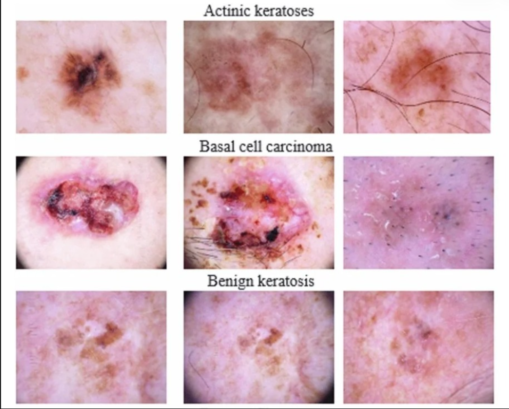

# 🔬 DermaAI — AI-Powered Skin Lesion Classification & Educational Assistant

> **AI for Healthcare | Deep Learning + Generative AI**

**DermaAI** is an AI-powered skin-lesion classification and educational assistance platform that combines **Computer Vision, Deep Learning, Transfer Learning, and Generative AI** in a single interactive application.

The system uses an **EfficientNetB3-based transfer-learning model** trained on the **HAM10000 dermoscopic image dataset** to classify suitable dermoscopic skin-lesion images into seven categories. The predicted class and confidence score are then used as context for **Google Gemini**, which generates understandable educational information and supports multilingual interaction.

> ⚠️ **Medical safety:** DermaAI is an educational/research prototype. It is **not a medical diagnostic system** and must not be used as a substitute for professional medical advice, diagnosis, or treatment.

---

## 🏆 Unstop — AI For Healthcare

### Problem Statement

**AI For Healthcare**

### Project Title

**DermaAI – AI-Powered Skin Lesion Classification & Educational Assistant**

### Project Description

DermaAI is an AI-powered skin-lesion classification and educational assistance platform designed to improve healthcare awareness and accessibility.

The system uses the **HAM10000** dermoscopic image dataset and an **EfficientNetB3-based transfer-learning model** to classify suitable dermoscopic skin-lesion images into seven categories:

1. Melanocytic Nevi
2. Melanoma
3. Benign Keratosis-like Lesions
4. Basal Cell Carcinoma
5. Actinic Keratoses / Intraepithelial Carcinoma
6. Vascular Lesions
7. Dermatofibroma

Uploaded images are preprocessed and analyzed by the trained deep-learning model to provide the most likely category and confidence score. The prediction is then passed to **Google Gemini** to generate understandable educational information about the predicted lesion and the importance of professional medical evaluation.

The application combines **image upload, AI classification, confidence analysis, Generative AI assistance, and multilingual interaction** in one interface.

For reliable results, users should provide clear dermoscopic skin-lesion images similar to the training data. Blurry, unrelated, or out-of-distribution images may produce unreliable predictions.

The system is intended for **educational and early-awareness purposes** and does not replace professional medical diagnosis.

---

## ✨ Why DermaAI?

Most image-classification systems stop after producing a class label.

DermaAI adds an educational layer:

```text
Dermoscopic Image
       ↓
Image Preprocessing
       ↓
EfficientNetB3
       ↓
7-Class Prediction
       ↓
Confidence Analysis
       ↓
Google Gemini
       ↓
Educational Explanation
       ↓
Multilingual Interaction
```

### Core idea

**Deep Learning for Classification.  
Generative AI for Understanding.  
AI for Healthcare.**

---

## 🚀 Key Features

- 🧠 EfficientNetB3-based skin-lesion classification
- 🔬 Seven-class classification using HAM10000
- 🖼️ Dermoscopic image upload and preprocessing
- 📊 Prediction confidence visualization
- 🤖 Google Gemini educational assistant
- 🌐 English, Kannada, and Hindi interaction
- 💬 Follow-up educational questions
- 🖥️ Interactive Streamlit dashboard
- 🔐 API-key protection through environment variables / secrets
- ⚠️ Built-in medical safety disclaimer
- 📓 Training notebook included in the project

---

# 🖥️ Application Preview

## 1. DermaAI Home / Landing Page


The landing page introduces the platform and clearly communicates that the system is designed for **educational, non-diagnostic exploration**.

---

## 2. Image Analyzer


Users can upload a suitable dermoscopic image and start the analysis pipeline.

The interface displays the major stages:

```text
Image Intake
     ↓
Neural Inference
     ↓
Confidence Profile
     ↓
Educational Layer
```

---

## 3. AI Analysis Results


The results interface presents:

- AI-predicted category
- Model confidence
- Probability distribution
- Educational context
- Clinical-awareness guidance

A low-confidence result is explicitly surfaced instead of presenting the model output as medical certainty.

---

## 4. System Profile


The system profile communicates the model, dataset, supported languages, and API/privacy architecture.

---

# 🖼️ Raw Dermoscopic Image Reference

The following image is included as a **raw visual reference** showing examples of lesion categories used for classification context.



> **Note:** The raw image is included for project documentation and visual reference. It should not be interpreted as a diagnostic chart.

---

# 🗂️ Dataset — HAM10000

DermaAI uses the **HAM10000 (Human Against Machine with 10000 training images)** dermoscopic dataset.

The dataset contains **10,015 images** across seven diagnostic categories and is notably class-imbalanced.

| Code | Category | Images |
|---|---|---:|
| `nv` | Melanocytic Nevi | 6,705 |
| `mel` | Melanoma | 1,113 |
| `bkl` | Benign Keratosis-like Lesions | 1,099 |
| `bcc` | Basal Cell Carcinoma | 514 |
| `akiec` | Actinic Keratoses / Intraepithelial Carcinoma | 327 |
| `vasc` | Vascular Lesions | 142 |
| `df` | Dermatofibroma | 115 |
| | **Total** | **10,015** |

### Why class imbalance matters

The number of samples differs substantially between classes. This makes **class distribution, balancing strategy, validation, and per-class evaluation** important when developing the classifier.

---

# 🧠 Deep Learning Model

## EfficientNetB3

The primary classification model is **EfficientNetB3** using transfer learning and fine-tuning.

### Model pipeline

```text
Input Image
     ↓
Preprocessing
     ↓
EfficientNetB3
     ↓
Feature Extraction
     ↓
Fine-Tuning
     ↓
Classification Layer
     ↓
Softmax Probabilities
     ↓
Predicted Class
     ↓
Confidence Score
```

The trained model is stored as:

```text
best_skin_model_phase2.keras
```

> **Important:** EfficientNetB3 is the model architecture used by DermaAI. It should not be confused with “EfficientNet V3.”

---

# 🔬 Image Processing

Uploaded images are prepared before inference:

```text
Raw Image
   ↓
Image Loading
   ↓
Image Conversion
   ↓
Image Resizing
   ↓
Numerical Representation
   ↓
Model-Compatible Preprocessing
   ↓
EfficientNetB3
```

The classifier performs best when the uploaded image is visually similar to the training distribution.

### Recommended input

- Clear image
- Good illumination
- Lesion clearly visible
- Proper focus
- Minimal obstruction
- Dermoscopic appearance similar to the training data

### Potentially unreliable inputs

- Blurry images
- Very dark or overexposed images
- Heavy obstruction
- Unrelated photographs
- Images significantly different from the training distribution

---

# ⚖️ Class Imbalance

HAM10000 is highly imbalanced:

```text
Melanocytic Nevi              6705
Melanoma                      1113
Benign Keratosis              1099
Basal Cell Carcinoma           514
Actinic Keratoses              327
Vascular Lesions               142
Dermatofibroma                 115
```

This distribution is important when interpreting overall accuracy because a model can perform well on majority classes while performing poorly on minority classes.

---

# 🏋️ Model Training Workflow

```text
HAM10000 Dataset
       ↓
Data Analysis
       ↓
Image Preprocessing
       ↓
Data Augmentation
       ↓
Class Balancing
       ↓
Train / Validation Split
       ↓
EfficientNetB3
       ↓
Transfer Learning
       ↓
Fine-Tuning
       ↓
Model Evaluation
       ↓
Best Model Selection
       ↓
Saved .keras Model
```

The training notebook is included so reviewers can inspect the machine-learning workflow.

---

# 📊 Model Evaluation

Model evaluation should consider more than accuracy.

Recommended evaluation metrics include:

- Accuracy
- Precision
- Recall
- F1-score
- Confusion matrix
- Per-class performance

The confusion matrix is particularly useful for identifying classes that the model frequently confuses.

> **Transparency:** Actual evaluation values should be taken directly from the training notebook. This README does not invent or estimate model performance numbers.

---

# 🤖 Generative AI — Google Gemini

Google Gemini acts as the **educational assistant layer**, not the primary image classifier.

### Important distinction

```text
EfficientNetB3
     ↓
Primary Image Classification
     ↓
Prediction + Confidence
     ↓
Google Gemini
     ↓
Educational Explanation
```

Gemini can provide:

- General educational information
- Explanation of the predicted category
- User-friendly descriptions
- Multilingual responses
- Answers to follow-up educational questions

This separation keeps the responsibilities of the two AI components clear.

---

# 🌐 Multilingual Support

DermaAI supports educational interaction in:

- 🇬🇧 English
- 🇮🇳 Kannada
- 🇮🇳 Hindi

The multilingual layer is intended to make educational information more accessible to users who prefer regional languages.

---

# 🔄 Complete System Architecture

```text
                         ┌─────────────────────┐
                         │     HAM10000        │
                         │   Dermoscopic Data  │
                         └──────────┬──────────┘
                                    ↓
                         ┌─────────────────────┐
                         │ Preprocessing +     │
                         │ Augmentation        │
                         └──────────┬──────────┘
                                    ↓
                         ┌─────────────────────┐
                         │    EfficientNetB3   │
                         │ Transfer Learning   │
                         └──────────┬──────────┘
                                    ↓
                         ┌─────────────────────┐
                         │ Prediction +        │
                         │ Confidence          │
                         └──────────┬──────────┘
                                    ↓
                         ┌─────────────────────┐
                         │    Google Gemini    │
                         │ Educational Layer  │
                         └──────────┬──────────┘
                                    ↓
              ┌─────────────────────┼─────────────────────┐
              ↓                     ↓                     ↓
          English                Kannada                Hindi
              └─────────────────────┼─────────────────────┘
                                    ↓
                         ┌─────────────────────┐
                         │ Follow-up Q&A /     │
                         │ Educational Context │
                         └─────────────────────┘
```

---

# 🛠️ Technology Stack

| Layer | Technology |
|---|---|
| Programming | Python |
| Deep Learning | TensorFlow / Keras |
| Model | EfficientNetB3 |
| Learning | Transfer Learning + Fine-Tuning |
| Dataset | HAM10000 |
| Image Processing | Pillow, NumPy |
| Generative AI | Google Gemini API |
| Web Application | Streamlit |
| Environment | python-dotenv |
| Model Format | `.keras` |
| Version Control | Git / GitHub |
| Deployment | Streamlit Community Cloud |

---

# 📁 Project Structure

```text
skin-disease/
│
├── app.py
├── best_skin_model_phase2.keras
├── requirements.txt
├── README.md
├── .gitignore
│
└── notebooks/
    └── skin_lesion_training.ipynb
```

### Important files

**`app.py`**  
Main Streamlit application containing the user interface, model loading, image prediction, and Gemini integration.

**`best_skin_model_phase2.keras`**  
Trained EfficientNetB3-based classification model.

**`notebooks/skin_lesion_training.ipynb`**  
Training and evaluation workflow.

**`requirements.txt`**  
Python dependencies required to run the application.

---

# ⚙️ Installation

## 1. Clone the repository

```bash
git clone https://github.com/Pavankm70/skin-disease.git
cd skin-disease
```

## 2. Create a virtual environment

### macOS / Linux

```bash
python3 -m venv venv
source venv/bin/activate
```

### Windows

```bash
python -m venv venv
venv\Scripts\activate
```

## 3. Install dependencies

```bash
pip install -r requirements.txt
```

---

# 🔐 Environment Variables

Create a `.env` file in the project root:

```env
GEMINI_API_KEY=YOUR_GEMINI_API_KEY
```

Never commit the real API key to GitHub.

Recommended `.gitignore` entries:

```text
.env
.streamlit/secrets.toml
venv/
__pycache__/
```

---

# ▶️ Run DermaAI Locally

Start the Streamlit application:

```bash
streamlit run app.py
```

Then open the local URL displayed by Streamlit.

---

# ☁️ Deployment

DermaAI can be deployed using **Streamlit Community Cloud**.

Required components include:

- GitHub repository
- `app.py`
- `requirements.txt`
- Trained `.keras` model
- Gemini API key configured securely through Streamlit Secrets

Example:

```toml
GEMINI_API_KEY = "YOUR_GEMINI_API_KEY"
```

The secret should never be hard-coded into source files.

---

# 🔒 Privacy & Security

DermaAI is designed as an educational prototype.

Security considerations include:

- API credentials stored outside source code
- Environment variables / Streamlit Secrets for Gemini credentials
- No API key exposed in the frontend
- Clear non-diagnostic messaging

Production healthcare deployment would require significantly stronger privacy, security, consent, audit, and regulatory controls.

---

# ⚠️ Limitations

### Dataset Dependency

The model learns from HAM10000 and may perform differently on images outside its training distribution.

### Class Imbalance

Some categories contain far fewer samples than others.

### Image Quality

Poor-quality images can reduce prediction reliability.

### Visual Similarity

Different lesion categories may share visual characteristics, leading to classification errors.

### Confidence Limitations

A confidence score is a model probability, **not medical certainty**.

### Clinical Validation

This project is an educational/research prototype and is not presented as a clinically validated diagnostic system.

---

# 🏥 Real-World Impact

Potential applications of the concept include:

- Healthcare education
- Skin-health awareness
- AI-assisted research
- Multilingual health information
- Educational support for students
- AI-assisted healthcare workflows
- Telehealth-related research

Real-world clinical deployment would require extensive validation, healthcare oversight, privacy protection, and applicable regulatory compliance.

---

# 🚀 Future Scope

Possible improvements include:

- Larger and more diverse datasets
- External validation datasets
- Improved class-imbalance handling
- Probability calibration
- Out-of-distribution detection
- Explainable AI with Grad-CAM
- Additional Indian languages
- Mobile application
- Doctor-oriented dashboard
- Secure healthcare data handling
- Telemedicine integration
- Clinical validation
- More advanced AI-assisted healthcare workflows

---

# 💡 Project Innovation

### Conventional workflow

```text
Image
  ↓
Classification
  ↓
Result
```

### DermaAI workflow

```text
Image
  ↓
Deep Learning Classification
  ↓
Prediction + Confidence
  ↓
Generative AI
  ↓
Educational Explanation
  ↓
Multilingual Interaction
  ↓
Follow-up Questions
```

The project therefore combines **specialized visual classification** with **generative educational assistance** rather than treating classification as the final user experience.

---

# 🏆 Hackathon Relevance

DermaAI demonstrates an end-to-end AI healthcare workflow:

```text
Healthcare Problem
       ↓
Dataset
       ↓
Data Analysis
       ↓
Image Processing
       ↓
Data Augmentation
       ↓
Class Balancing
       ↓
Deep Learning
       ↓
Transfer Learning
       ↓
Model Training
       ↓
Model Evaluation
       ↓
Model Prediction
       ↓
Generative AI
       ↓
Multilingual Assistance
       ↓
Web Application
       ↓
Healthcare Awareness
```

This directly aligns the project with the **AI For Healthcare** track.

---

# 🔗 Project Links

### 💻 GitHub Repository

**Pavankm70/skin-disease**

https://github.com/Pavankm70/skin-disease

### 🚀 Live Demo

**DermaAI Live Demo**

> Add the deployed Streamlit URL here before submitting the final Unstop form.

### 📓 Training Notebook

`notebooks/skin_lesion_training.ipynb`

---

# 👥 Project Information

| Field | Details |
|---|---|
| Project | DermaAI |
| Track | AI For Healthcare |
| Domain | Healthcare + Artificial Intelligence |
| Focus | Skin Lesion Classification + Generative AI |
| Model | EfficientNetB3 |
| Dataset | HAM10000 |
| Generative AI | Google Gemini |
| Interface | Streamlit |

---

# ⚠️ Medical Safety Disclaimer

DermaAI is an **educational and research prototype**.

It is **not a medical diagnostic tool**, and its predictions should not be used to make medical decisions.

The system may produce incorrect predictions, particularly for images that differ from its training data.

Users should consult a qualified healthcare professional or dermatologist for diagnosis, treatment, or concerns regarding a skin lesion.

The project demonstrates the application of **Deep Learning, Computer Vision, Transfer Learning, and Generative AI in healthcare**.

---

## 🔬 DermaAI

> **Deep Learning for Classification.**  
> **Generative AI for Understanding.**  
> **AI for Healthcare. 🚀**
